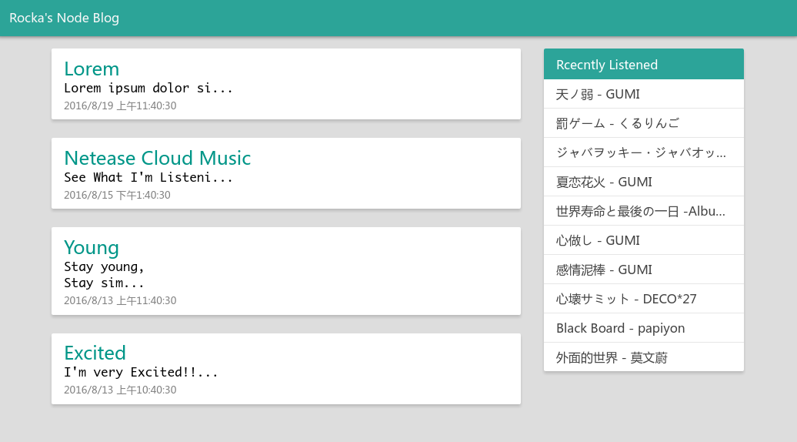

# BlogNode
a simple and light blog program using nodejs.

## ScreenShot


## Demo Site
[Click Me](https://rocka-blog-node.herokuapp.com)

## Features
- Pjax everywhere
- Config via Json file
- Responsive layout [see Demos](./DemoPic)
- Get Netease Cloud Music listening record

## Quick Start
Clone the repository
```bash
git clone https://github.com/Rocket1184/BlogNode.git
```

Start Server
```bash
npm start
```

Open in browser

[BlogNode](http://localhost:8080)

## TODO
- [ ] Article tags
- [ ] Writing new article in browser
- [ ] Comments
- [ ] Archive by time
- [ ] Better Markdown support
- [ ] Friendly 404 Page
- [ ] Page Animation

## Furthermore
- OAuth for comments
- Plugin system
